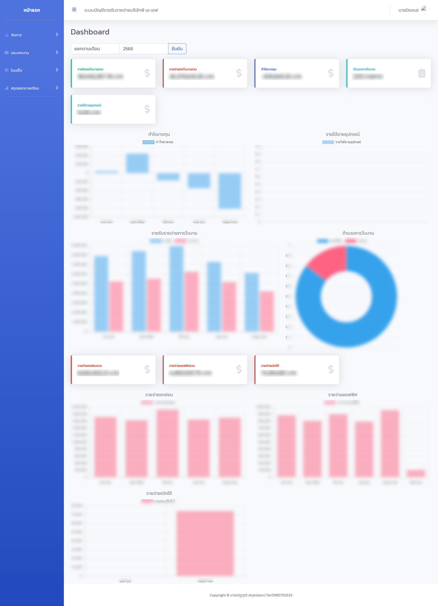
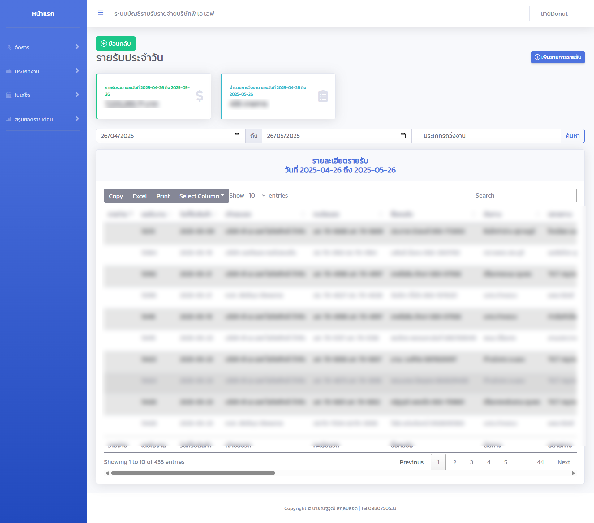
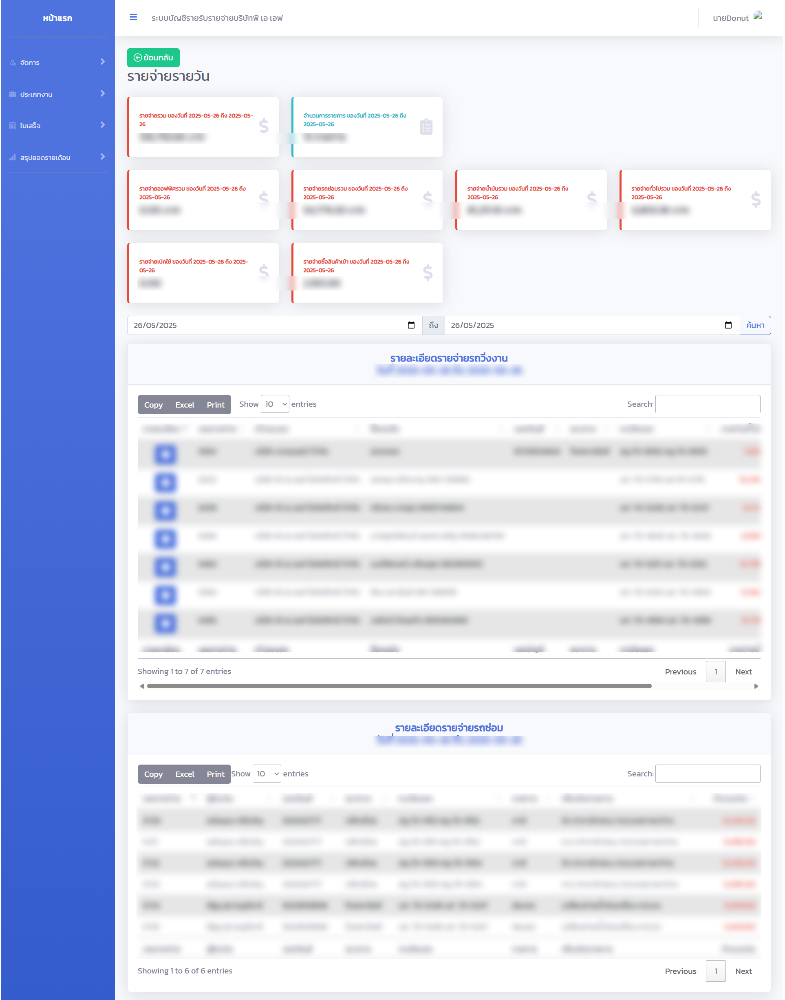
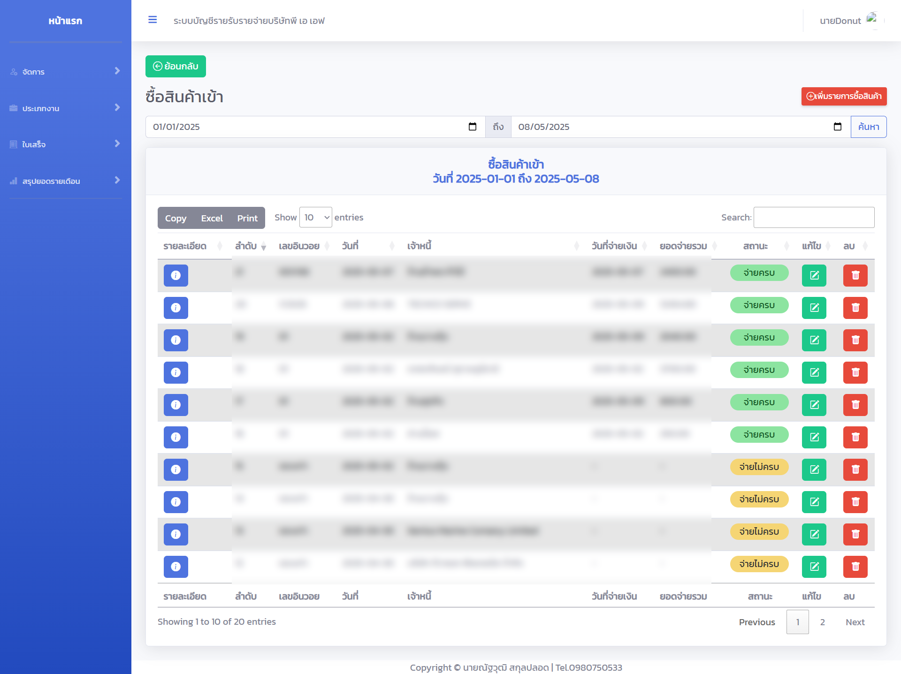
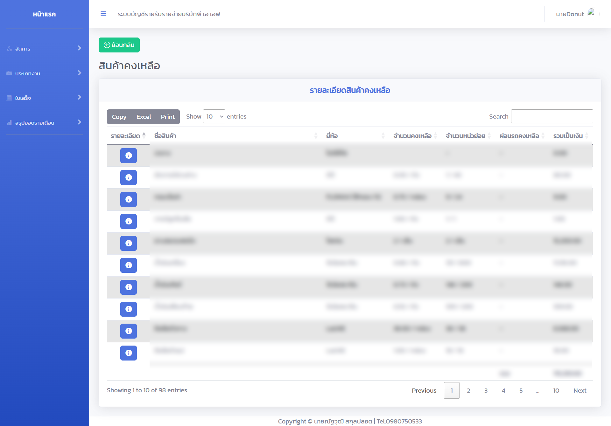
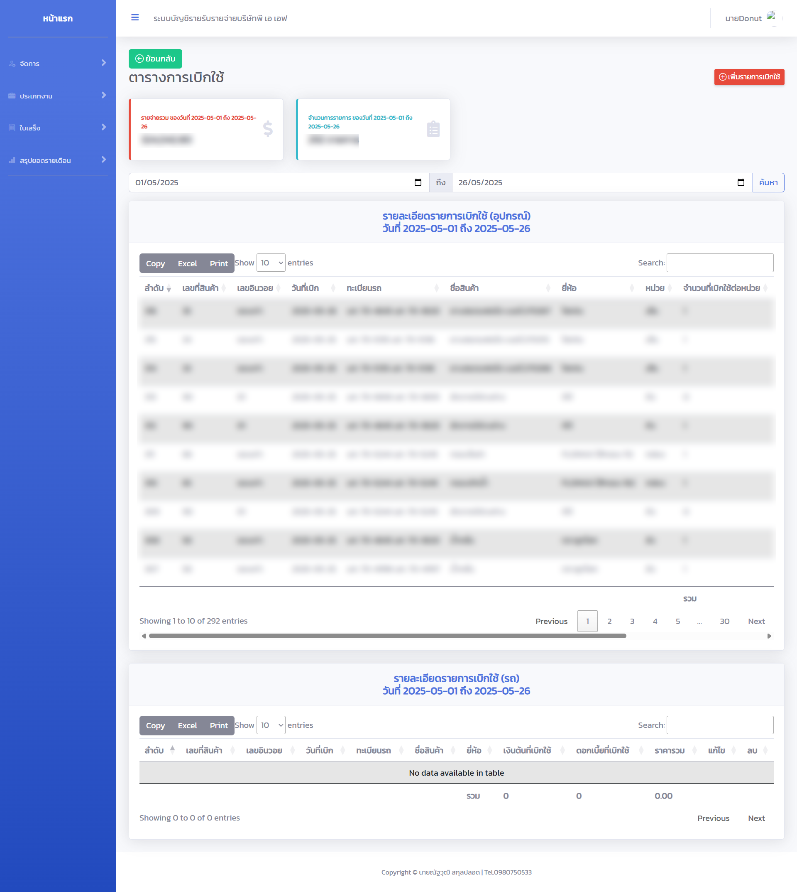
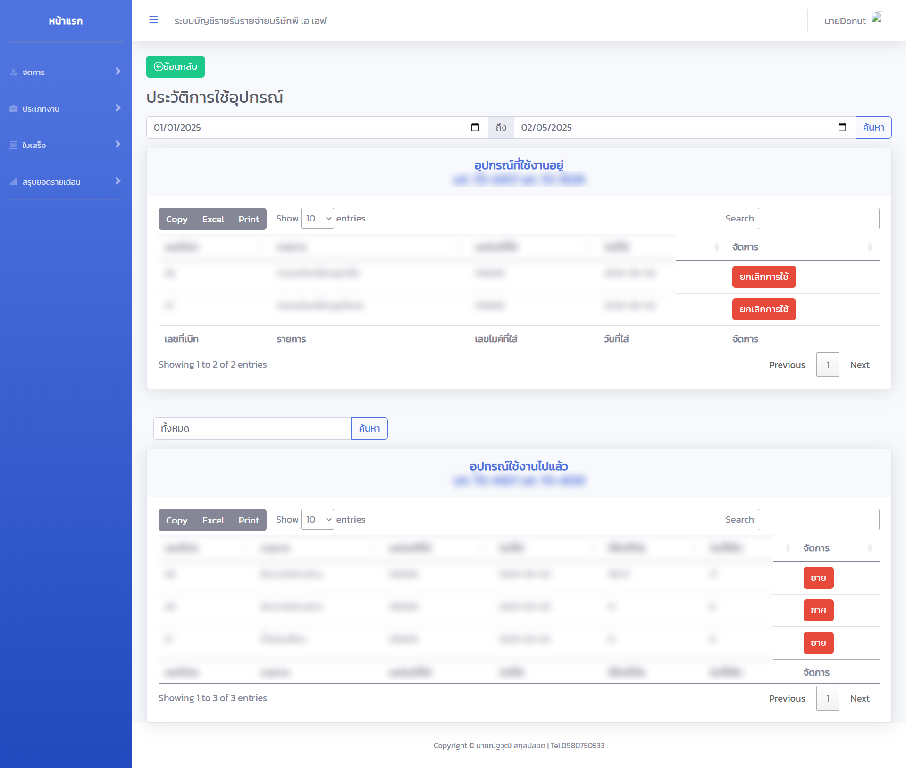
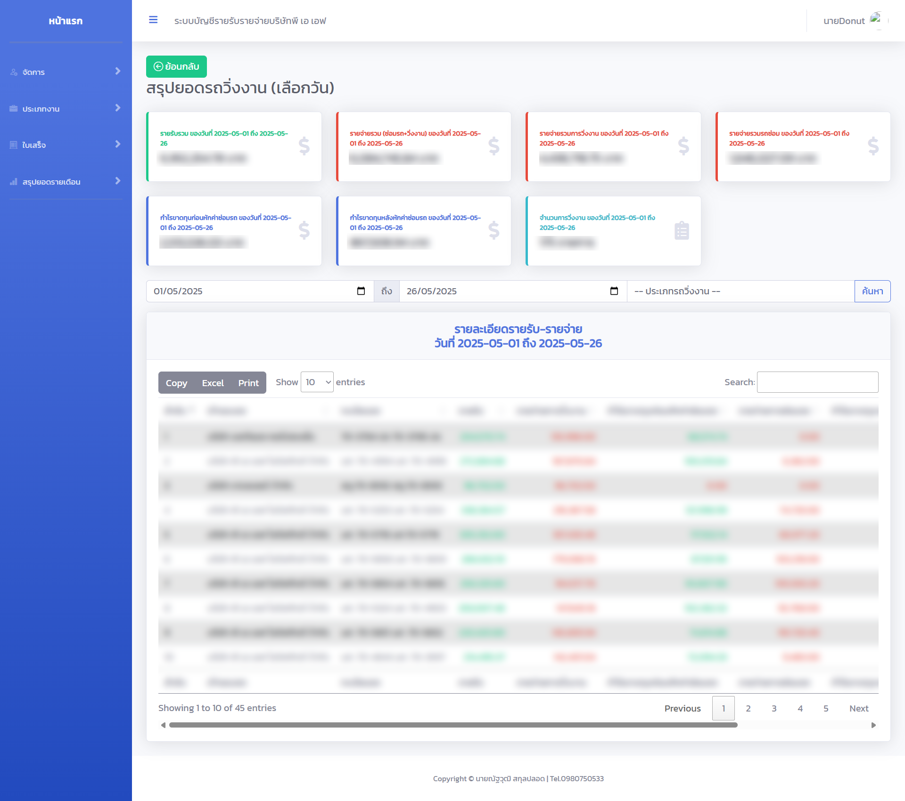
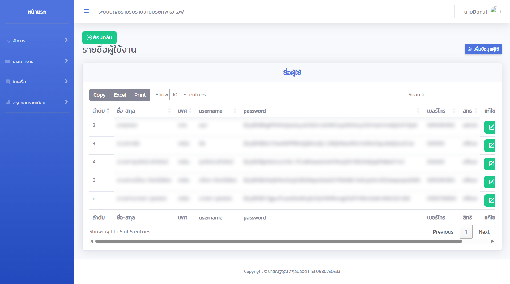

# Logistics ERP Web Application

**Client:** P.A.F. Logistics Co., Ltd.  
**Role:** Freelance Web Developer  
**Duration:** April 2025  
**Tech Stack:** PHP, MySQL, Bootstrap, jQuery

---

## Project Overview

This project involved taking over and continuing development of an internal ERP module for a logistics company. The system manages core operations such as income and expense tracking, inventory (stock-in and withdrawals), equipment usage, user accounts, and operational reports. It is customized to suit the company’s specific logistics workflow.

I enhanced the codebase by refactoring core modules and implementing new features to improve usability and maintainability. The system was deployed on a rented web hosting server and is used daily in real operations.

---

## Screenshots

> ⚠️ *Note: Only selected screens are shown here with permission from the client. Sensitive data has been blurred for confidentiality.*

### Dashboard Overview  
  
Displays summaries of total income, expenses, and overall profit or loss.

### Income & Expense  

  
  

  
Daily income and expense entries with totals and details.

### Inventory – Stock In  

  
  

  
Tracks purchased items added to stock and current stock levels.

### Inventory – Withdrawals  
  
Logs which items were withdrawn, for which vehicles, and in what quantity.

### Equipment Usage  
  
Displays equipment currently in use, the assigned vehicle, and allows cancellation or sale of equipment.

### Reports  
  
Generates daily reports across multiple modules.

### User Management  
  
Manage system users — create, edit, and delete user accounts.

---

## Contributions

- Took over the project from a previous developer and continued its development  
- Refactored key modules to improve code quality and maintainability  
- Added new features based on business requirements  
- Delivered a functional, production-ready ERP system used in day-to-day logistics operations  

---

## Notes

This repository does not contain any source code due to client confidentiality. It is intended as a portfolio showcase with selected screenshots and a project summary only.
